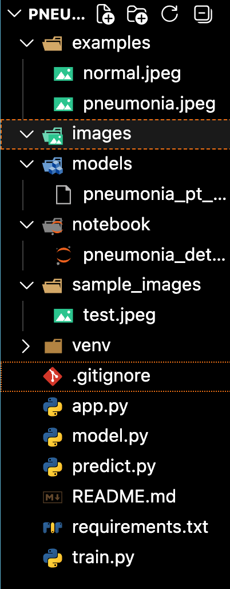

#  AI-Based Pneumonia Detection System

A Deep Learning-based web application that detects **Pneumonia** from Chest X-ray images using **PyTorch** and **MobileNetV2**.

---

##  Demo



---

## Features

- Detects **NORMAL** and **PNEUMONIA**
- Confidence score for each prediction
- Interactive Gradio web interface
- MobileNetV2 Transfer Learning
- Built using PyTorch

---

##  Model

- Backbone: MobileNetV2
- Framework: PyTorch
- Loss Function: Binary Cross Entropy Loss
- Optimizer: Adam
- Epochs: 6

---

##  Performance

| Metric | Score |
|---------|-------|
| Accuracy | **95%** |
| Precision | **95%** |
| Recall | **95%** |
| F1 Score | **95%** |

Confusion Matrix

```
[[219  15]
 [ 16 374]]
```

Classification Report

```
              precision    recall    f1-score

NORMAL          0.93       0.94       0.93
PNEUMONIA       0.96       0.96       0.96

Overall Accuracy = 95%
```

---

##  Technologies Used

- Python
- PyTorch
- Torchvision
- Gradio
- PIL
- NumPy

---

##  Project Structure

```
Pneumonia-Detection/
│
├── app.py
├── model.py
├── predict.py
├── train.py
├── requirements.txt
├── README.md
│
├── models/
│   └── pneumonia_pt_best.pth
│
├── notebook/
│   └── mlproject.ipynb
│
├── examples/
│
└── images/
```

---

##  Run the Project

Clone the repository

```bash
git clone https://github.com/YOUR_USERNAME/Pneumonia-Detection.git
```

Move into the project

```bash
cd Pneumonia-Detection
```

Install dependencies

```bash
pip install -r requirements.txt
```

Run

```bash
python app.py
```

Open

```
http://127.0.0.1:7860
```

---

##  Dataset

Kaggle Chest X-Ray Pneumonia Dataset

https://www.kaggle.com/datasets/paultimothymooney/chest-xray-pneumonia

---

##  Developer

**Mohit Soni**

MCA Student

National Institute of Technology Kurukshetra

---

##  If you like this project, please give it a star.